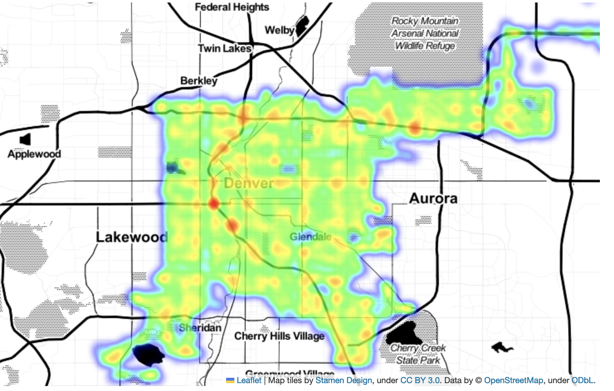
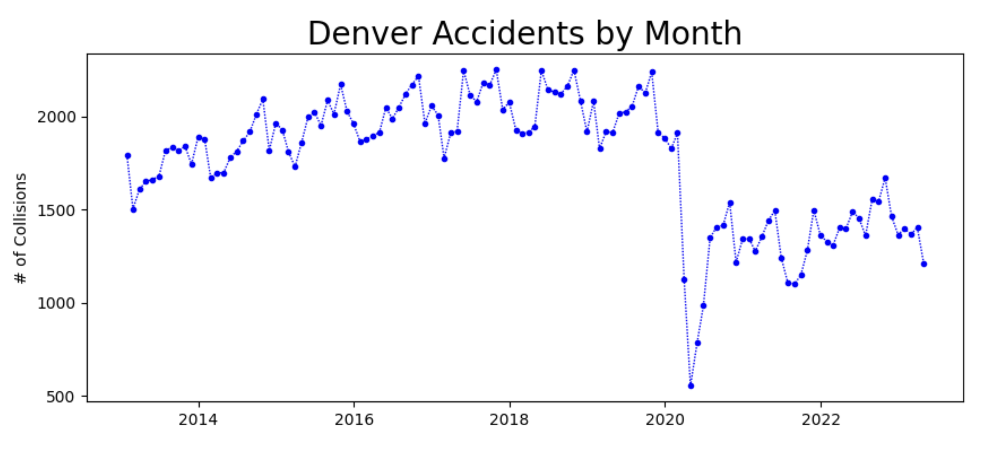
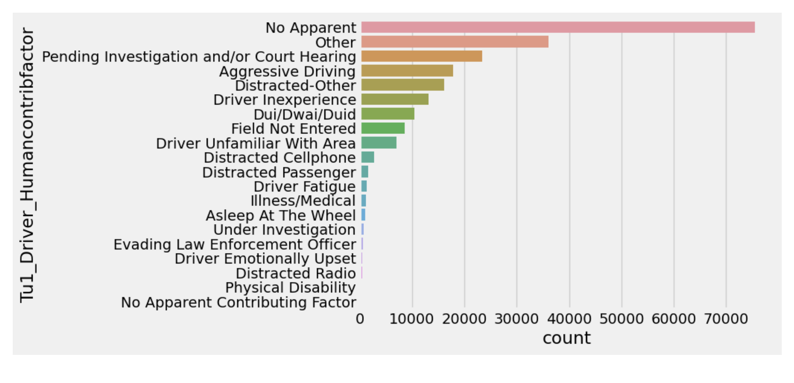
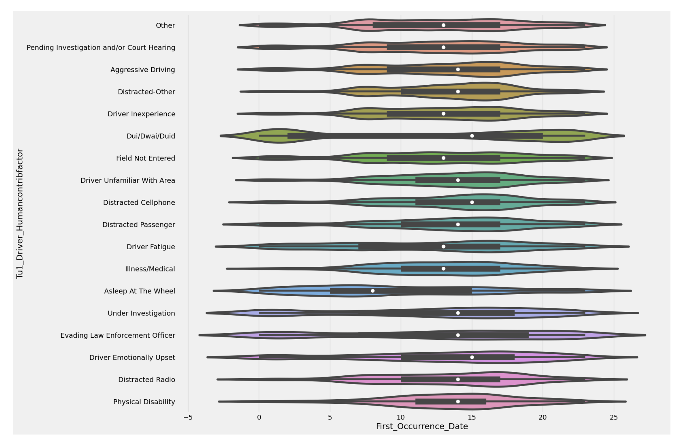

# Denver-traffic-accidents

Description: This is the project folder that accompanies the dataset and notebook I put on Kaggle.
Contents: 
 - `notebooks` folder with `EDA` and `Munging the data` notebooks
 - `images` folder with images for both kaggle and github
 -  `src` folder with the contents of the munging notebook modified for production

Note: The data file is too large to put on Github but it resides [here](https://www.kaggle.com/datasets/hrokrin/denver-traffic-accidents)

# Discussion

According to the CDC, traffic accidents cost [Colorado 943M$ in 2018](https://www.cdc.gov/transportationsafety/pdf/statecosts/2020/CDC-Cost-of-Crash-Deaths-Fact-Sheets_Colorado.pdf) alone, And that number doesn't seem to include the property loss. In 2022 an article in [Denverite](https://denverite.com/2022/01/14/so-how-many-traffic-accidents-occured-on-denvers-neighborhood-streets-in-2021-this-many/) noted there were >3100 wrecks on streets with a speedlimit of 25 mph. Of those 3100+ accidents, 84 resulted in a fatality.
As a result the city approved the "20 is plenty" ordinance, cutting the speed limit to 20mph.
  
# Takeaways from the Sample EDA notebook 
1. While there are some common accident sites (shown here with a heatmap) essentially the entire city is fair game.

 

2. Covid had a major positive impact on accidents.

 

3. Ruling out non-causes such at "No Apparent", "Other" and "Pending Investigation and/or Court Hearing" we can see aggressive and distracted driving are major issues. Notably, distracted cellphone is smaller that what one might expect.

 

4. DUI/DWAI/DUID related accidents match our intuition of happening more at in the evening hours

 

 5. There is a slight degree of seasonality. This is also seen the monthly chart above, however this aggregates the 10 years.

